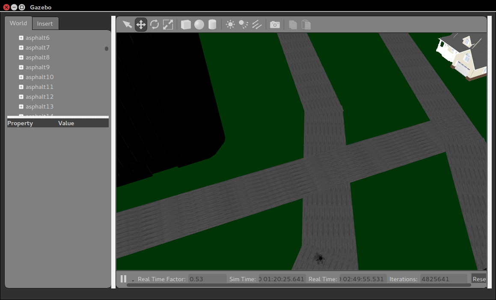
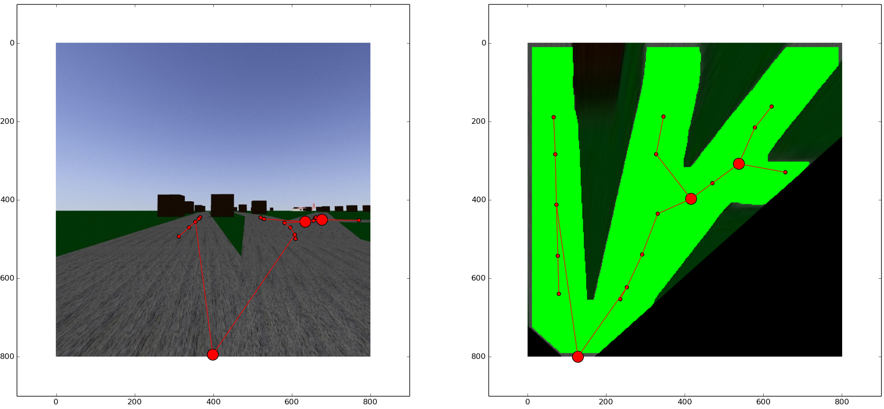

3D road line extraction, bird's-eye view projection, and junction detection for ROS stereo images
===============

Finds the middle line of a road, and its junctions, in a stereo image. Tested with ROS+Gazebo (DRC Atlas robot), but should work with any stereo camera as input. 

A Convolutional Neural Network, [CN24](https://github.com/cvjena/cn24), is used for road detection. Subsequently, a birds-eye view is calculated using OpenCV's findHomography and warpPerspective. Line segments are obtained by thinning the detected road, simplifying with a voxel grid filter, and calculating a minimum spanning tree of the resulting points.

Requires:
- numpy, scipy, matplotlib 
- skimage
- cv2
- pcl (optional)
- ROS and rospy to capture image data (optional)

Examples
===============

Detected road in first-person camera image (left), obtained by a simulated robot, and the same image warped to bird's eye perspective (right)

Actual environment

Detected road in first-person camera image (left), obtained by a simulated robot, and the same image warped to bird's eye perspective (right)

Actual environment

